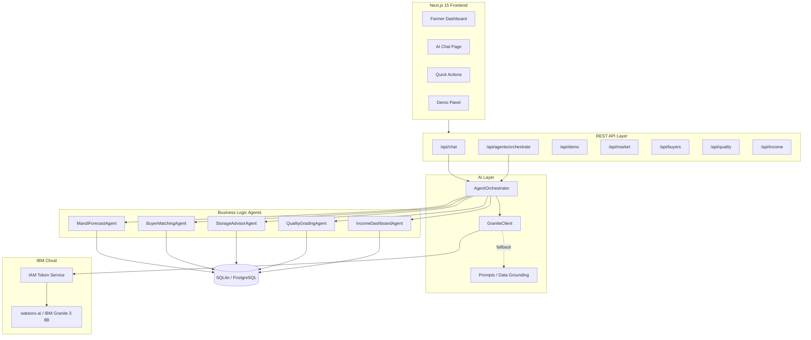

# 🌾 KisanSetu AI

**AI-Powered Market Linkage Platform for Cotton & Groundnut Farmers in Gujarat**

[](https://www.python.org/)
[](https://fastapi.tiangolo.com/)
[](https://nextjs.org/)
[](https://www.ibm.com/products/watsonx-ai)
[](LICENSE)
[](docker-compose.yml)

---

KisanSetu AI connects smallholder farmers to markets using five specialized AI agents — all grounded in real data and synthesized by **IBM Granite** (watsonx.ai). Farmers ask questions in **English, Gujarati, or Hindi** and receive actionable, data-backed answers about prices, buyers, storage, quality, and income.

> **No invented data.** IBM Granite handles only language and reasoning. Every number — price, buyer offer, income estimate — comes from a deterministic agent.

---

## ✨ Features

- **🤖 Multi-Agent Orchestration** — Five specialized agents run in parallel; intent routing selects only the agents relevant to each query
- **💬 Multilingual AI Chat** — Full support for English (`en`), Gujarati (`gu`), and Hindi (`hi`)
- **📈 Mandi Price Forecasting** — 15-day price predictions for cotton and groundnut across Gujarat APMCs
- **🤝 Buyer Matching** — Finds the best buyers by price, location, and crop variety
- **🏪 Storage Advisor** — Sell-now vs. store-and-wait recommendations with break-even analysis
- **✅ Quality Grading** — Parameter-based quality scoring (moisture, length, grade)
- **💰 Income Dashboard** — Net income estimates with cost deductions and risk levels
- **🔒 Responsible AI** — All forecasts labelled `ESTIMATE`; graceful fallback when Granite is unavailable
- **🐳 Docker-Ready** — Single `docker compose up --build` starts backend, frontend, and PostgreSQL

---

## 🏗️ Architecture

```
Farmer Question (English / Gujarati / Hindi)
           ↓
   AgentOrchestrator — intent classification
           ↓
  ┌────────────────────────────────────────┐
  │  MandiForecastAgent  → price forecast  │
  │  BuyerMatchingAgent  → buyer offers    │
  │  StorageAdvisorAgent → sell/store rec  │
  │  QualityGradingAgent → quality score   │
  │  IncomeDashboardAgent→ net income est  │
  └────────────────────────────────────────┘
           ↓
   Structured JSON (grounded, deterministic)
           ↓
     IBM Granite 3 8B (watsonx.ai)
           ↓
  Simple, actionable farmer response
```



---

## 📁 Project Structure

```
kisansetu-ai/
├── backend/
│   ├── main.py                      # FastAPI application entry point
│   ├── requirements.txt             # Production dependencies
│   ├── requirements-dev.txt         # Dev/test dependencies (pytest)
│   ├── Dockerfile
│   ├── app/
│   │   ├── ai/
│   │   │   ├── granite_client.py    # IBM Granite / watsonx.ai client
│   │   │   ├── orchestrator.py      # AgentOrchestrator — intent + execution
│   │   │   └── prompts.py           # Data-grounded prompt templates
│   │   ├── api/
│   │   │   ├── chat.py              # POST /api/chat
│   │   │   ├── agents.py            # POST /api/agents/orchestrate
│   │   │   ├── demo.py              # GET/POST /api/demo
│   │   │   ├── market.py            # Market prices
│   │   │   ├── buyers.py            # Buyer matching
│   │   │   ├── quality.py           # Quality grading
│   │   │   └── income.py            # Income estimates
│   │   ├── agents/
│   │   │   ├── buyer_matching/
│   │   │   ├── storage_advisor/
│   │   │   ├── quality/
│   │   │   └── income/
│   │   ├── forecasting/             # Mandi price forecasting
│   │   ├── models/                  # SQLAlchemy ORM models
│   │   ├── schemas/                 # Pydantic request/response schemas
│   │   └── database/                # DB connection & migrations
│   └── tests/                       # 303 tests across all phases
│
├── frontend/
│   ├── app/
│   │   └── farmer/
│   │       ├── dashboard/page.tsx   # Main farmer dashboard
│   │       ├── chat/page.tsx        # AI chat interface
│   │       ├── buyers/page.tsx      # Buyer matching view
│   │       ├── quality/page.tsx     # Quality grading view
│   │       ├── income/page.tsx      # Income dashboard
│   │       └── advisor/page.tsx     # Storage advisor
│   ├── components/
│   │   ├── dashboard/
│   │   │   ├── AIChatWidget.tsx     # AI chat with agent status
│   │   │   ├── DemoPanel.tsx        # One-click demo scenario
│   │   │   ├── QuickActions.tsx     # Quick action buttons
│   │   │   └── BestBuyerCard.tsx
│   │   └── ui/
│   │       ├── DataSourceBadge.tsx  # LIVE / DEMO / ESTIMATE badges
│   │       └── ResponsibleAINotice.tsx
│   ├── locales/
│   │   ├── en.json                  # English
│   │   ├── gu.json                  # Gujarati
│   │   └── hi.json                  # Hindi
│   ├── lib/api.ts                   # Axios API client
│   ├── hooks/useLanguage.ts         # Language switcher hook
│   └── Dockerfile
│
├── data/seed/seed.py                # Demo seed data
├── docker-compose.yml
├── .env.example                     # All required environment variables
└── app.json                         # IBM Cloud / Code Engine deployment manifest
```

---

## 🚀 Quick Start

### Prerequisites

| Tool | Version |
|------|---------|
| Python | 3.11+ |
| Node.js | 18+ |
| Git | any |
| Docker + Compose | optional, for container mode |

### 1 — Clone & configure

```bash
git clone https://github.com/your-org/kisansetu-ai.git
cd kisansetu-ai
cp .env.example .env
# Edit .env — add IBM credentials to enable Granite (optional; app runs without them)
```

### 2 — Start the backend

```bash
cd backend
python -m venv venv
source venv/bin/activate        # Windows: venv\Scripts\activate
pip install -r requirements.txt
python -m uvicorn main:app --reload --port 8000
```

- API: http://localhost:8000  
- Swagger docs: http://localhost:8000/docs

### 3 — Start the frontend

```bash
cd frontend
npm install
npm run dev
```

- App: http://localhost:3000

### 4 — Load demo data (optional)

```bash
cd data/seed
python seed.py
```

---

## 🐳 Docker Deployment

```bash
docker compose up --build
```

| Service | URL |
|---------|-----|
| Frontend | http://localhost:3000 |
| Backend API | http://localhost:8000 |
| PostgreSQL | localhost:5432 |

---

## ⚙️ Environment Variables

Copy [`.env.example`](.env.example) to `.env` and set the values below.

| Variable | Required | Default | Description |
|----------|----------|---------|-------------|
| `DATABASE_URL` | ✅ | — | PostgreSQL connection string |
| `IBM_API_KEY` | ⬜ | — | IBM Cloud IAM API key (enables Granite) |
| `IBM_PROJECT_ID` | ⬜ | — | watsonx.ai project ID |
| `IBM_GRANITE_MODEL` | ⬜ | `ibm/granite-3-8b-instruct` | Granite model ID |
| `IBM_REGION` | ⬜ | `us-south` | IBM Cloud region |
| `SECRET_KEY` | ✅ | — | JWT signing secret (≥ 32 chars) |
| `CORS_ORIGINS` | ✅ | `http://localhost:3000` | Allowed frontend origins (comma-separated) |
| `NEXT_PUBLIC_API_URL` | ✅ | `http://localhost:8000` | Backend URL (baked into frontend at build time) |
| `MARKET_DATA_PROVIDER` | ⬜ | `demo` | `demo` for synthetic data, `live` for AgMarkNet/eNAM |
| `MARKET_API_KEY` | ⬜ | — | API key for live market data |

> **Without IBM credentials** the app runs in **deterministic fallback mode** — all agents work normally, structured data is returned, and Granite synthesis is skipped. The UI shows *"AI Service Unavailable — Showing rule-based market analysis"*.

---

## 🤖 IBM Granite Integration

Granite handles **only language and reasoning** — never data generation:

| Task | Responsible component |
|------|-----------------------|
| Intent classification | Granite (fallback: keyword heuristic) |
| Final answer synthesis | Granite |
| Multilingual response | Granite |
| Market prices | `MandiForecastAgent` |
| Buyer offers | `BuyerMatchingAgent` |
| Storage recommendation | `StorageAdvisorAgent` |
| Quality score | `QualityGradingAgent` |
| Income estimate | `IncomeDashboardAgent` |

Legacy variable names (`WATSONX_URL`, `WATSONX_PROJECT_ID`, `IBM_CLOUD_API_KEY`) are also accepted for backwards compatibility.

---

## 📡 API Reference

### `POST /api/chat`

```json
{
  "message": "Should I sell my cotton now?",
  "language": "en",
  "farmer_id": 1,
  "crop": "cotton",
  "mandi": "Rajkot APMC",
  "quantity": 100.0
}
```

```json
{
  "answer": "Current price: ₹7,200/q ...",
  "agents_used": ["forecast", "storage"],
  "granite_used": true,
  "data_timestamp": "2024-01-15T10:30:00",
  "confidence": 78
}
```

### `POST /api/agents/orchestrate`

```json
{
  "farmer_id": 1,
  "message": "Find the best buyer and tell me whether I should sell now.",
  "language": "en",
  "crop": "cotton",
  "mandi": "Rajkot APMC",
  "quantity": 100.0
}
```

```json
{
  "agents_used": ["buyer", "forecast", "storage"],
  "failed_agents": [],
  "results": { "buyer": {}, "forecast": {}, "storage": {} },
  "final_answer": "...",
  "confidence": 75,
  "granite_used": false
}
```

### Other endpoints

| Endpoint | Description |
|----------|-------------|
| `GET /health` | Health check with version and agent status |
| `GET /api/market/prices/latest?crop=cotton` | Latest market prices |
| `GET /api/buyers/matches?crop=cotton` | Buyer matching results |
| `GET /api/agents/storage-advisor/preview` | Storage advice preview |
| `GET /api/agents/income/preview` | Income estimate preview |
| `GET /api/chat/status` | Granite availability status |
| `GET /api/demo/farmer` | Pre-configured demo farmer profile |
| `POST /api/demo/run` | Run full demo scenario (all agents) |

---

## 🧭 Intent Routing

| Intent | Trigger keywords | Agents invoked |
|--------|-----------------|----------------|
| `PRICE` | price, rate, mandi | forecast |
| `FORECAST` | forecast, predict, will price | forecast |
| `BUYER` | buyer, who buy, find buyer | buyer |
| `SELL_OR_STORE` | sell now, store, wait, hold | storage, forecast |
| `QUALITY` | quality, grade, test | quality |
| `INCOME` | income, earn, profit, how much | income, forecast, buyer |
| `COMPLEX` | 3+ aspects detected | forecast, buyer, storage, income |
| `GENERAL` | anything else | storage, forecast |

Complex queries trigger all four main agents in one pass with a single Granite synthesis call.

---

## 🌐 Language Support

| Language | Code | Script |
|----------|------|--------|
| English | `en` | Latin |
| Gujarati | `gu` | ગુજરાતી |
| Hindi | `hi` | हिन्दी |

Granite generates the explanation in the requested language. Agents always return language-agnostic JSON. Numerical values are always in digits (₹7,200), never spelled out.

---

## 🎬 Demo Flow

A pre-configured cotton farmer scenario runs without any setup:

1. Open http://localhost:3000/farmer/dashboard
2. Click **Load Demo** in the Demo Panel
3. Click **Run Full Analysis**
4. Switch between English, Gujarati, and Hindi

The demo query:

> *"I have 100 quintals of cotton in Rajkot. Find the best buyer, predict the price for the next 15 days, tell me whether I should sell or store, and estimate my income."*

Expected response includes: current market price · 15-day forecast · best buyer offer · sell/store recommendation · expected net income · risk level · confidence score.

---

## 🧪 Tests

```bash
cd backend
pip install -r requirements-dev.txt

# Run all 303 tests
python -m pytest tests/ -v

# Individual test suites
python -m pytest tests/test_market_phase2.py -v   # Market data & forecasting (45)
python -m pytest tests/test_granite_phase8.py -v  # Granite, orchestrator, intent (48)
python -m pytest tests/test_ux_phase9.py -v       # Translations, demo API, responsible AI (38)
python -m pytest tests/test_phase10_final.py -v   # Regression, security, CORS, fallback (44)
```

| Test file | Tests | Coverage |
|-----------|------:|---------|
| `test_market_phase2.py` | 45 | Market data, prices, forecasting |
| `test_market_phase3.py` | — | Mandi forecast |
| `test_market_phase4.py` | — | Buyer matching |
| `test_market_phase5.py` | — | Storage advisor |
| `test_quality_phase6.py` | ~20 | Quality grading agent |
| `test_income_phase7.py` | ~35 | Income dashboard agent |
| `test_granite_phase8.py` | 48 | Granite client, orchestrator, grounding |
| `test_ux_phase9.py` | 38 | Translations, demo API, responsible AI |
| `test_phase10_final.py` | 44 | Health, backward-compat, security, CORS |

---

## 🛡️ Responsible AI

1. **No invented data** — Granite only references facts supplied in the structured prompt
2. **Transparent uncertainty** — Forecasts are labelled `ESTIMATE`, never presented as fact
3. **No profit guarantees** — The system never guarantees a specific income outcome
4. **Data source labelling** — UI shows `LIVE` / `DEMO` / `ESTIMATE` badges on all figures
5. **Fallback transparency** — Users are told when AI synthesis is unavailable
6. **Credential safety** — IBM API keys are server-side only; never returned in API responses
7. **Failure disclosure** — If an agent fails, the response explicitly states which data is missing

---

## 🔐 Security

- IBM API keys and secrets loaded from environment variables — never hardcoded
- CORS restricted to configured origins via `CORS_ORIGINS`
- Security headers on every response: `X-Content-Type-Options`, `X-Frame-Options`, `X-XSS-Protection`, `Referrer-Policy`, `Cache-Control: no-store`
- Global exception handler prevents stack trace leakage (500 → generic JSON)
- Pydantic validation on all inputs (422 on malformed requests)
- System prompts never returned in API responses
- No credentials stored in the frontend bundle
- Production Docker image excludes all test dependencies

---

## ☁️ IBM Cloud Deployment

See [`ibm-cloud-deploy.md`](ibm-cloud-deploy.md) for the full IBM Cloud Code Engine deployment guide, including:

- Container Registry (`us.icr.io`) setup
- Code Engine application deployment
- IBM Cloud Databases for PostgreSQL
- Secrets and ConfigMaps
- CORS configuration for production URLs
- Health check verification

---

## 🧰 Technology Stack

| Layer | Technology |
|-------|-----------|
| AI / LLM | IBM Granite 3 8B Instruct (watsonx.ai) |
| Backend | FastAPI 0.111, Python 3.11+ |
| ORM | SQLAlchemy 2.0 |
| Validation | Pydantic 2.7 |
| HTTP client (backend) | httpx 0.27 |
| Database | SQLite (dev) / PostgreSQL 15 (prod) |
| Frontend | Next.js 15, React 19, TypeScript 5 |
| Styling | Tailwind CSS 3 |
| Charts | Recharts 2 |
| Internationalisation | next-intl 3 |
| HTTP client (frontend) | Axios 1.7 |
| Containerisation | Docker, Docker Compose 3.9 |
| Testing | pytest, FastAPI TestClient |

---

## ⚠️ Known Limitations

- **No real-time market data** — Uses synthetic data in demo mode. Connect a live AGMARKNET/eNAM API key (`MARKET_DATA_PROVIDER=live`) for production use.
- **Image-based quality grading** — The quality agent supports manual parameter input. Image-based grading requires a vision model (future work).
- **Voice input** — Placeholder UI exists; speech-to-text is not yet implemented.

---

## 🗺️ Roadmap

1. **Live market data** — Integrate AGMARKNET / eNAM / commodity exchange APIs
2. **Farmer authentication** — OTP or Aadhaar-based sign-in
3. **Push notifications** — Alert farmers when prices hit target thresholds
4. **Image-based quality** — Vision model for cotton/groundnut photo assessment
5. **Voice input** — Web Speech API / Whisper for low-literacy farmers
6. **Offline PWA** — Service worker caching for rural low-connectivity use

---

## 📄 License

MIT — see [LICENSE](LICENSE) for details.

---

*KisanSetu AI — Connecting Farmers to Markets with IBM AI*
